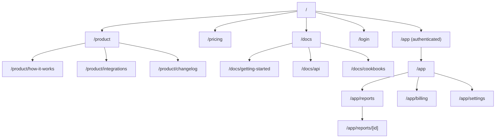
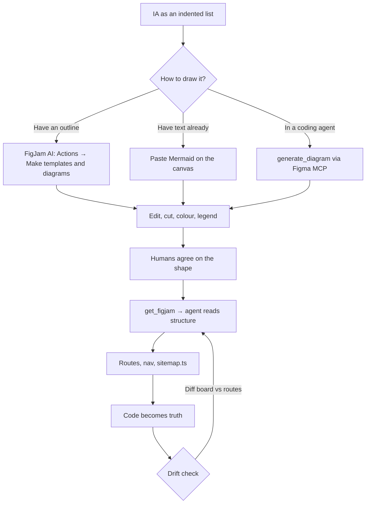

# The Complete Guide: FigJam Sitemaps & IA with AI

> A sitemap is the cheapest place to be wrong. Draw it in FigJam, let AI draft the boring first pass — then let your coding agent read the board back as structure.

**Last verified: September 2026**

**Series: Chris Wander · New Paper Series**

---

## The Big Picture

Every app has a shape: which pages exist, which ones nest under which, and how a person gets from one to another. That shape is your **information architecture** (IA), and the picture of it is your **sitemap**. When you build in the wrong shape, you don't find out until you're deep in routing code, already committed to folders, and someone asks "wait, where does billing live?"

FigJam is the right surface for this because a sitemap is a graph and FigJam is a graph editor — and because it's collaborative, so the person who owns the content and the person who owns the code can argue about the shape on the same canvas, before either of them has written it down.

```
   THE IA IS THE ARGUMENT. THE SITEMAP IS THE PICTURE OF IT.

   ┌────────────────────────────────────────────────────────────┐
   │  1. IA (decide the shape)                                  │
   │     group pages by purpose → name them → nest them         │
   └───────────────────────────┬────────────────────────────────┘
                               │
                ┌──────────────┼──────────────┐
                ▼              ▼              ▼
        ┌───────────┐  ┌───────────┐  ┌──────────────┐
        │ FigJam AI │  │  Mermaid  │  │  you + team  │
        │ prompt →  │  │  paste →  │  │  drag boxes  │
        │  board    │  │  board    │  │  by hand     │
        └───────────┘  └───────────┘  └──────────────┘
                               │
                               ▼
   ┌────────────────────────────────────────────────────────────┐
   │  2. SITEMAP (FigJam board)                                 │
   │     shapes = screens · connectors = navigation             │
   │     sections = regions · colour = meaning                  │
   └───────────────────────────┬────────────────────────────────┘
                               │
                               ▼
   ┌────────────────────────────────────────────────────────────┐
   │  3. AGENT READS THE BOARD (Figma MCP)                      │
   │     get_figjam → XML + screenshots                         │
   │     agent now knows the shape as STRUCTURE, not prose      │
   └───────────────────────────┬────────────────────────────────┘
                               │
                               ▼
   ┌────────────────────────────────────────────────────────────┐
   │  4. CODE (routes, files, nav)                              │
   │     app/(marketing)/pricing/page.tsx · sitemap.ts · nav.ts │
   └───────────────────────────┬────────────────────────────────┘
                               │
                               └──→ board drifts → redraw → repeat
```

The single most important idea: **the board is not a deliverable, it is an input.** Its value is highest the moment *before* code exists, and lowest the moment the code becomes the source of truth. Draw it early, let AI accelerate the first pass, and don't pretend it stays true forever.

### The analogy table

| Term | Plain-English analogy | Why it matters to you |
|---|---|---|
| **Information architecture (IA)** | The library's catalog system | The *decision*: what exists and how it's grouped |
| **Sitemap** | The floor plan of the building | The *picture* of that decision: pages and how they connect |
| **User flow** | The route a visitor walks through the building | Ordered steps toward a goal; a sitemap is the map, a flow is a path on it |
| **Node / shape** | A room | One screen or page |
| **Connector** | A doorway | A navigation path between two screens |
| **Section** | A floor or wing | A grouping in FigJam that says "these belong together" |
| **Legend** | The sign explaining the color coding | Without it, nobody knows what your colours mean — including future you |
| **FigJam AI** | A junior designer who drafts fast and wrong sometimes | Generates boards, diagrams, and timelines from a prompt |
| **Mermaid** | A text format that *is* a diagram | Diagrams you can diff, store in a repo, and paste onto the canvas |
| **Figma MCP server** | An interpreter standing in the room | Lets an AI agent read and write the board as structured data |
| **`generate_diagram`** | "Draw this for me" as a tool call | Turns Mermaid or a description into an editable FigJam diagram |
| **`get_figjam`** | "Read me the room" as a tool call | Turns the board into XML your agent can reason over |

> **The one-sentence version:** decide the IA in prose, draw it in FigJam with AI's help, then hand the *board itself* to your coding agent so the shape survives the trip from whiteboard to route tree.

---

## The 60-Second Version (TL;DR)

1. **IA first, sitemap second.** Group pages by purpose and name them before you draw anything. A pretty diagram of a bad structure is still a bad structure.
2. **FigJam AI drafts the board.** Toolbar → **Actions** → **Make templates and diagrams**, then hand it a structured outline. You get boxes and connectors you can edit.
3. **Mermaid is the power tool.** Paste Mermaid syntax onto a FigJam board and it renders as an editable diagram. Your coding agent already speaks Mermaid.
4. **`generate_diagram` is the agent-native path.** The Figma MCP server can turn a description or Mermaid into a FigJam diagram — and it has a skill you must load first.
5. **`get_figjam` reads the board back.** It returns XML plus node screenshots, so your agent gets the *structure*, not a summary.
6. **Install the remote MCP server** at `https://mcp.figma.com/mcp`. One command per client (Claude Code, Codex, Cursor, VS Code, Xcode). OAuth, all plans.
7. **Keep the legend.** Colour and shape must carry meaning, or the board is decoration.
8. **Link real Figma frames to nodes** as screens appear, so the board becomes the index of your product, not a stale drawing.
9. **Reality check the AI.** Figma says its AI outputs "may be misleading or wrong" — treat the first pass as a draft, not a decision.
10. **Plan for drift.** The code will become the truth. Decide now whether you re-sync the board or let it retire.

If you read nothing else, read **Part 3 (prompt-to-sitemap)** and **Part 6 (the agent loop)**.

---

## Prerequisites

- A **Figma account**. FigJam is free to try; **AI tools in FigJam require a paid plan and a Full, Dev, or Collab seat**.
- A **FigJam file** you can edit. New file → **FigJam**.
- For the AI-draft path: an outline of your pages. Plain text or a chat answer is enough.
- For the MCP path:
  - A **supported MCP client**: Claude Code, Codex, Cursor, VS Code, Xcode, and others. Check the Figma MCP catalog for the current list.
  - **OAuth access** to Figma. You sign in through Figma's OAuth flow on first connect.
  - **Node.js** only if your client needs it — the MCP server itself is hosted, so there's no local server to run.
- For the worked example: a **Next.js App Router** project (any version; the concepts are stable).

> **Seat and plan gotchas before you start:** the **remote** MCP server is available on all seats and plans. The **desktop** MCP server needs a Dev or Full seat on a paid plan. **Write-to-canvas** requires the remote server and is currently **free during the beta** — Figma states it will eventually be a usage-based paid feature. **FigJam AI tools** require a paid plan and the right seat. Check `https://www.figma.com/mcp-catalog/` and the Figma pricing page rather than trusting a summary — including this one.

---

## Part 1 — IA, Sitemaps, and Flows: Get the Words Right

Three terms get used interchangeably and it causes real confusion. Keep them separate:

| Term | The question it answers | In FigJam |
|---|---|---|
| Information architecture | *What content exists, and how is it grouped?* | The content of your boxes and sections |
| Sitemap | *Which pages exist, and how do they connect?* | The tree of shapes and connectors |
| User flow | *What sequence does a person follow to do X?* | A path through the map, often drawn separately |

A sitemap is one component of IA, not the whole of it. Figma's own guidance draws the line the same way: IA is the broader organisation of information; the sitemap is the visual map of how pages relate.

### 1.1 Why FigJam specifically

Figma's best-practices guidance is blunt about the reason: a sitemap is a collaboration artifact, and FigJam is built for collaboration. You can build a sitemap in real time alongside product partners to investigate a new feature, think through the high-level architecture, and map out feature interactions — and it lives next to the designs, so as designs evolve you can update the sitemap and link specific Figma frames to nodes in the diagram.

That adjacency is the real argument. A sitemap in a separate diagramming tool is a document. A sitemap in FigJam is an index that points at the actual product.

### 1.2 Lead with IA, and start early

The most expensive mistake is drawing a sitemap before you've decided the IA. Two practices worth adopting:

- **Card sorting before boxes.** Ask participants to group related content into buckets, with existing labels or with labels they invent. You are testing whether your mental model matches theirs. Cheaper now than in routing code.
- **Start IA before design and development.** Once a route tree exists, the sitemap becomes a description of decisions already made rather than a tool for making them.

> **Rule of thumb:** if you cannot write the IA as an indented list, you are not ready to draw the sitemap. The list is the input; the diagram is the output.

---

## Part 2 — The Craft: Building a Sitemap Board That Actually Communicates

Before AI enters the room, learn the primitives. AI drafts the *first pass*; these are the rules that make the pass readable and correctable.

### 2.1 The vocabulary of the board

| FigJam element | What it represents | Notes |
|---|---|---|
| Shape | A screen or page | Keep one shape style per level of the tree |
| Connector | A navigation path | Arrow direction = direction of travel |
| Section | A region of the site (`/app`, `/marketing`) | Use sections to group; name them |
| Text | Labels and annotations | Page names; short and consistent |
| Stamp / sticker | Emphasis | Mark pain points, "new", "needs work" |
| Legend | The key | Non-negotiable if you use colour |
| Code block | A snippet, e.g. the Mermaid source | Keep the source next to the picture |

### 2.2 Draw a sitemap by hand, correctly

The mechanics from Figma's own walkthrough:

1. Drag a few **shapes** from the toolbar.
2. Click the **connector** tool and draw the connections between them.
3. Add more nodes with the **+** icon to get pre-built connectors.
4. Customise with **different shapes, colours, strokes, and text**.

Then apply the craft rules:

- **Colour must carry meaning.** Use colour to indicate a screen's depth in the site, or a related feature — not for decoration. Figma's guidance is explicit about this, and explicitly requires a **legend**.
- **Group with shapes.** Use shapes to group nodes and communicate their relationship.
- **Name consistently.** Same casing, same patterns. "Pricing", "Pricing / Plans", "Pricing / FAQ" reads better than three different naming schemes.
- **Lay it out in one direction.** Top-to-bottom or left-to-right. Not both.
- **Annotate the journey.** Use text, stamps, and stickers to highlight pain points, moments of success, and places that need more design work.
- **Link real frames to nodes.** As screens get designed, link the Figma frame to the diagram node. That is what keeps the board alive.
- **Export when you present.** A sitemap can be exported as JPG, PNG, or PDF for slides or documentation.

### 2.3 The naming convention that saves you later

Your boxes should map cleanly onto your routes. Write the route *in* the box:

```text
Home                (/)
Products            (/products)
  Product detail    (/products/[slug])
Pricing             (/pricing)
Docs                (/docs)
  Getting started   (/docs/getting-started)
Billing             (/app/billing)
```

Two payoffs. First, the board is self-documenting for anyone who reads routes. Second, when you hand the board to your coding agent, the page names are already the nouns it needs for folder names.

---

## Part 3 — Prompt-to-Sitemap with FigJam AI

### 3.1 What FigJam AI can and cannot make

Figma's documentation is precise about the categories it generates:

| It generates | It does not generate |
|---|---|
| Boards for meetings and team exercises | Your IA decisions |
| Diagrams, mind maps, and flow charts | Guarantees of accuracy |
| Visual timelines and Gantt charts | Anything you didn't describe |
| Plans for team projects | (a sitemap is a tree/flow — you get there by describing the IA) |

A sitemap is, mechanically, a **flow chart of page hierarchy**. So the trick isn't a named "sitemap" button — it's handing FigJam AI a structured IA and asking for the tree.

> **Honesty note:** Figma's help centre lists the diagram types it can create — flow charts, Gantt charts, and org charts. It does not publish a "sitemap" generator. Prompting a sitemap works because a sitemap *is* a tree diagram, and the AI accepts a structured outline. Treat any specific prompt below as a starting recipe, not a documented API.

### 3.2 The exact clicks

1. Open your FigJam file.
2. From the toolbar, click **Actions**.
3. Select **Make templates and diagrams**.
4. Pick a suggested template or click the **Let's make a…** field.
5. Enter your own prompt (or a suggestion) and click **Make**.
6. Adjust the prompt and click **Make** again to create a new version.

Anyone with `can edit` access can use it. It's available on all paid plans.

### 3.3 The prompt recipe for a sitemap

The documented prompting guidance for FigJam diagrams is: **the more detail you provide, the more custom the result**. For boards it suggests an agenda, goals, and attendee context. For a sitemap, adapt that to structure:

- **Name the artefact and the shape.** "a sitemap tree" beats "a diagram".
- **Give the hierarchy as an indented list.** The AI's output quality tracks the structure of your input.
- **State the levels.** "Top-level navigation, then sections, then sub-pages."
- **Say what to include for each node if you have it.** Route paths, brief purpose, whether it's public or authenticated.

Here is a prompt that follows the docs' advice:

```text
Make a sitemap tree for a competitive-audit SaaS.

Top-level navigation:
- Home (/)
- Product (/product)
- Pricing (/pricing)
- Docs (/docs)
- Sign in (/login)

Under Product:
- How it works (/product/how-it-works)
- Integrations (/product/integrations)
- Changelog (/product/changelog)

Under Docs:
- Getting started (/docs/getting-started)
- API reference (/docs/api)
- Cookbooks (/docs/cookbooks)

Under the authenticated area (/app), nested:
- Dashboard (/app)
  - Reports (/app/reports)
    - Report detail (/app/reports/[id])
  - Billing (/app/billing)
  - Settings (/app/settings)

Show public pages and authenticated pages grouped separately.
Label each node with its page name and route path.
```

Then refine. "Adjust your prompt and click **Make** to create a new visual" is a documented loop — the first pass is meant to be corrected.

### 3.4 Generate the IA with a chat model first

The most reproducible workflow I've found (and the one the tutorials converge on) is: get the IA as text from an LLM, then feed that text to FigJam.

```text
Create an information architecture for an AI customer-support application.
Group it into top-level navigation, then sections, then sub-pages.
Name every page and suggest a route path.
Output it as an indented list only.
```

Paste the result into the FigJam prompt. The text model is better at *deciding* the structure; FigJam AI is better at *drawing* it. Let each do its job.

### 3.5 What to do with the output

- **Move boxes.** The output is fully editable — drag objects, update text, adjust connections like anything you drew by hand.
- **Rename ruthlessly.** AI page names will be generic. Replace them with your vocabulary.
- **Re-colour by level.** Apply your depth colour scheme and write the legend.
- **Cut.** A generated sitemap tends to be *complete* rather than *right*. Delete pages you would never build.

> **Accuracy warning, straight from Figma:** "AI outputs may be misleading or wrong... should be regarded as a general reference and not a fact." Figma tells users to verify and cross-check before making decisions, to disclose that output is AI-generated, and to use the features only under its Acceptable Use Policy.

---

## Part 4 — Mermaid and `generate_diagram`: Diagrams as Text

### 4.1 Paste Mermaid onto the canvas

This is the highest-leverage feature in the whole workflow and it is easy to miss. Figma's connector documentation states it plainly: you can **paste Mermaid.js syntax onto the board to render diagrams like flowcharts, system diagrams, or ERDs**. Generated diagrams are fully editable afterward.

Why it matters: Mermaid is ASCII. It diffs. It lives in your repo. Your coding agent writes it natively. So a sitemap can exist as text first, and become a FigJam board second.

A sitemap in Mermaid:



Paste that onto a FigJam board and you get an editable sitemap. Store the same block in `docs/sitemap.mmd` and you have a versioned source of truth.

> **When to reach for Mermaid over FigJam AI:** when the structure already exists (an LLM wrote it, or you exported your route tree), when you want it in version control, or when you want a deterministic result instead of a generated one.

### 4.2 `generate_diagram`: the agent-native path

The Figma MCP server exposes a tool called **`generate_diagram`** that generates a FigJam diagram from Mermaid syntax or a natural-language description. Per Figma's docs:

- **No file context required** — it can create a new FigJam file or add to an existing one.
- **Supported diagram types:** flowchart, Gantt chart, state diagram, sequence diagram, architecture diagram, and ERD. (The official `figma-generate-diagram` skill lists the Mermaid subset as `flowchart`, `sequenceDiagram`, `stateDiagram`/`stateDiagram-v2`, `gantt`, and `erDiagram`.)
- **You don't have to write Mermaid.** Describe the diagram and the agent generates the Mermaid and calls the tool.
- **To force it,** include the directive *"Use the Figma MCP generate_diagram tool"* in your prompt.

Example prompts from the docs:

```text
create a flowchart for the user authentication flow using the Figma MCP generate_diagram tool
generate a gantt chart for the project timeline using the Figma MCP generate_diagram tool
generate an ERD for a blog database with users, posts, and comments using the Figma MCP generate_diagram tool
create a diagram from this mermaid syntax: ...
```

Two things to know:

- **A skill is mandatory.** Figma's own skill documentation says `figma-generate-diagram` is a **mandatory prerequisite — load this skill BEFORE every `generate_diagram` tool call**. The client plugins usually load it for you. If your client is bare, read the skill off GitHub first.
- **It does not support everything.** Pie charts, mind maps, Venn diagrams, class diagrams, timelines, and quadrant charts are out. Ask for those and you'll get an error, not a diagram.

### 4.3 What it explicitly will not do

Per the tool description, `generate_diagram` does not support font changes or moving individual shapes around. If you need those, open the diagram in Figma and edit it there. It also does not support generating Figma *designs* — that is a different tool.

---

## Part 5 — Install the Figma MCP Server

The MCP server is what turns the board into something an agent can read and write. There are two versions. Use the remote one.

| | Remote (preferred) | Desktop |
|---|---|---|
| Endpoint | `https://mcp.figma.com/mcp` | Local, via the Figma desktop app |
| Install | No desktop app needed | Requires the Figma desktop app |
| Seats / plans | All seats and plans | Dev or Full seat, paid plans |
| Write to canvas | Yes | No |
| Best for | Everyone | Specific org/enterprise use cases |

### 5.1 Claude Code

**Preferred — the plugin** (includes MCP settings and Agent Skills):

```bash
claude plugin install figma@claude-plugins-official
```

**Manual:**

```bash
claude mcp add --transport http figma https://mcp.figma.com/mcp

# Make it available across all projects:
claude mcp add --scope user --transport http figma https://mcp.figma.com/mcp
```

Then start a new Claude Code instance, run `/mcp`, select **figma**, authenticate, and click **Allow Access**. You should see `Authentication successful. Connected to figma`.

### 5.2 Codex

**Preferred — the Codex app:** install the app, open **Plugins**, click **+** next to Figma, and authenticate.

**Manual (CLI):**

```bash
codex mcp add figma --url https://mcp.figma.com/mcp
```

Authenticate when prompted.

### 5.3 Cursor

**Preferred — the plugin:** type `/add-plugin figma` in Cursor's agent chat.

**Manual:** use Cursor's Figma MCP deep link, click **Install**, then **Connect** → **Open** → **Allow access**.

### 5.4 VS Code

Install the Figma MCP, or open the MCP configuration (`⌘ Shift P` → **MCP: Open User Configuration** or **MCP: Open Workspace Folder MCP Configuration**) and add:

```json
{
  "inputs": [],
  "servers": {
    "figma": {
      "url": "https://mcp.figma.com/mcp",
      "type": "http"
    }
  }
}
```

Click **Start**, then **Allow Access**.

### 5.5 Xcode (beta)

Settings → **Intelligence** → **Plug-ins** → **Add plug-in** → **Add from URL** → `https://github.com/figma/mcp-server-guide` → choose the **Figma Plug-in** → authorise. Requires Xcode 27 beta.

### 5.6 The skills that matter for FigJam

Skills are instructions that tell an agent *which* tools to use and in what order. For this workflow, two are load-bearing:

- **`figma-use-figjam`** — read/write access to a board (stickies, sections, connectors, shapes, tables, code blocks).
- **`figma-generate-diagram`** — the mandatory prerequisite for `generate_diagram`.

Figma distributes skills through its client plugins, its Community, and the `figma/mcp-server-guide` repo. If your agent invents tool arguments, the fix is usually a stale or missing skill.

### 5.7 Verify the connection

Ask a question that requires the server:

```text
Who am I in Figma, and which plans do I have?
```

That exercises `whoami`, which returns your email, your plans, and your seat type. If it answers, the server is live.

---

## Part 6 — The Agent Loop: Draw, Read Back, Implement

This is the part that justifies the whole setup. The loop has four moves.

### 6.1 Move 1 — the agent draws the board

```text
Use the Figma MCP generate_diagram tool to create a sitemap flowchart for
this Next.js app. Public pages: /, /product, /pricing, /docs.
Authenticated pages under /app: /app, /app/reports, /app/reports/[id],
/app/billing, /app/settings. Include the route path in each node label.
```

`generate_diagram` creates its own file — per the tool's description, do **not** call `create_new_file` first.

### 6.2 Move 2 — you and the team edit the board

AI gives you a starting tree. Humans give you the *right* tree. Rename nodes, cut pages, add sections, write the legend, and argue about where billing lives. This is the step AI cannot do, because it doesn't know your product.

### 6.3 Move 3 — the agent reads the board back

`get_figjam` converts a FigJam diagram to **XML**, returning layer IDs, names, types, positions, sizes — and screenshots of the nodes.

```text
Use get_figjam to read the board at <paste the FigJam URL>.
Summarise the page hierarchy as an indented list of route paths,
and tell me which nodes are orphaned (no inbound connector).
```

The argument for passing the board rather than a prose summary is the one Figmalion's coverage makes: the agent picks up dependency order from the arrows and scope from the swimlanes. **The diagram is doing prompt work the prose used to do.** Node IDs, connector directions, and section membership are all information a paragraph loses.

### 6.4 Move 4 — implement against the structure

Now the agent has the shape. It can create the route tree, the nav config, and the sitemap metadata file — all from structure rather than a guess.

### 6.5 The worked example: sitemap board → Next.js routes

You have a FigJam board (drawn by `generate_diagram`, edited by you). You want:

1. the folders and `page.tsx` files,
2. the nav config,
3. a `sitemap.ts` for metadata routes.

Prompt:

```text
Read the FigJam board with get_figjam. Then, in my Next.js App Router project:

1. Create the route tree for every public page, using route groups where it
   helps: e.g. app/(marketing)/pricing/page.tsx.
2. Create app/lib/nav.ts exporting the navigation as typed data, grouped by
   top-level section.
3. Create app/sitemap.ts returning a MetadataRoute.Sitemap for the public pages
   only (skip authenticated /app/*).
4. Do not invent pages that are not on the board.
```

A reasonable `nav.ts` shape for the agent to produce:

```ts
// app/lib/nav.ts — generated from the FigJam sitemap, then hand-maintained
export type NavItem = {
  label: string;
  href: string;
  children?: NavItem[];
};

export const nav: NavItem[] = [
  { label: "Home", href: "/" },
  {
    label: "Product",
    href: "/product",
    children: [
      { label: "How it works", href: "/product/how-it-works" },
      { label: "Integrations", href: "/product/integrations" },
      { label: "Changelog", href: "/product/changelog" },
    ],
  },
  { label: "Pricing", href: "/pricing" },
  {
    label: "Docs",
    href: "/docs",
    children: [
      { label: "Getting started", href: "/docs/getting-started" },
      { label: "API reference", href: "/docs/api" },
      { label: "Cookbooks", href: "/docs/cookbooks" },
    ],
  },
];
```

And a `sitemap.ts` that only includes public routes:

```ts
// app/sitemap.ts
import type { MetadataRoute } from "next";

const BASE_URL = "https://example.com";

const publicPaths = [
  "/",
  "/product",
  "/product/how-it-works",
  "/product/integrations",
  "/product/changelog",
  "/pricing",
  "/docs",
  "/docs/getting-started",
  "/docs/api",
  "/docs/cookbooks",
];

export default function sitemap(): MetadataRoute.Sitemap {
  return publicPaths.map((path) => ({
    url: `${BASE_URL}${path}`,
    lastModified: new Date(),
  }));
}
```

> **This is the honest ceiling of the workflow.** The board gets you a correct *first* tree. The code then becomes the source of truth. From here on, the board is documentation, and documentation drifts. Decide now whether you'll redraw it each time the IA changes or retire it once routing stabilises.

### 6.6 Bonus move — the board as a briefing

Because `use_figma` can write to a FigJam board, the loop also runs the other way: an agent can build the board from a plan, a ticket, or a codebase, then you review the visual as a team before anyone implements.

```text
Create a FigJam board for our Q4 roadmap: a section per workstream, stickies
for each initiative, and connectors showing dependencies.
```

Then the team reviews the board, not a document.

---

## Part 7 — Keeping the Board Honest

A sitemap that lies is worse than no sitemap. Three habits:

1. **Link frames as they exist.** As designs evolve, link the specific Figma frame to the node. The board becomes the index; the frame is the truth for that page.
2. **Version the Mermaid.** Keep the source block in the repo (`docs/sitemap.mmd`). If the board and the file disagree, the file wins, and you can regenerate.
3. **Re-run the read-back before big changes.** Ask the agent to `get_figjam` the board and diff the node list against your actual route tree. Orphaned nodes and missing pages surface fast.

```text
Read the FigJam board and list every route path in the nodes.
Then list every route in my app/ directory.
Show me (a) nodes with no matching route, and (b) routes with no matching node.
```

That one prompt is a cheap IA-drift check you can run any time.

---

## Part 8 — Limits, Costs, and Data

### 8.1 Accuracy

Figma's own warning applies to the whole AI surface: outputs may be inaccurate, incomplete, or misleading. The company tells users to verify and cross-check before relying on AI output for decisions, and to disclose when they're presenting AI-generated work. For a sitemap, that means: **AI drafts, a human decides.**

### 8.2 Data handling for FigJam AI

Figma's documentation states that its agreement with OpenAI provides that **data is not used for model training**. Input into AI features is sent to OpenAI for processing, and is temporarily retained in OpenAI's environment to provide the service, but not used for training. Figma publishes its AI subprocessors.

### 8.3 Plans, seats, and what might cost money

| Capability | Requirement | Status |
|---|---|---|
| FigJam AI tools | Paid plan + Full, Dev, or Collab seat | Available; can be enabled/disabled |
| Remote MCP server | Any seat, any plan | Available |
| Desktop MCP server | Dev or Full seat, paid plan | Available |
| Write to canvas (`use_figma`) | Remote server + supported client | Free during beta; will become usage-based |
| `generate_diagram` | Remote server + skill + supported client | Free during beta |

> **This changes fast.** Figma's own note says the agent-facing capabilities will eventually be usage-based paid features, currently free during beta. Re-check the MCP catalog, Figma pricing, and the developer docs before you build a process that depends on the free tier.

### 8.4 What the tools cannot do

- `generate_diagram`: no pie charts, mind maps, Venn diagrams, class diagrams, timelines, quadrant charts, or font changes. Not for Figma *designs*.
- `get_figjam`: FigJam only — it is not a general Figma-file reader.
- The remote server is link-based for design context: your client cannot navigate to the URL, it extracts the node ID. Selection-based prompting is a desktop-server feature.
- Anything requiring *why* a decision was made. The board records structure, not rationale. Put the rationale in a sticky.

---

## Cheat Sheet

```text
# FigJam AI: prompt-to-board
Toolbar → Actions → Make templates and diagrams → type prompt → Make

# Mermaid: text-to-board
Write Mermaid in a file → copy → paste directly onto the FigJam canvas

# Figma MCP: remote server endpoint
https://mcp.figma.com/mcp

# Install, by client
claude plugin install figma@claude-plugins-official
claude mcp add --scope user --transport http figma https://mcp.figma.com/mcp
codex mcp add figma --url https://mcp.figma.com/mcp
/add-plugin figma                      # Cursor agent chat
# VS Code: MCP user config → { "servers": { "figma": { "url": "…", "type": "http" } } }
```

| Tool | Direction | Use it for |
|---|---|---|
| `generate_diagram` | agent → board | Draw a sitemap/flowchart/ERD from Mermaid or a description |
| `use_figma` | agent → board | Create/edit board content: stickies, sections, connectors, shapes |
| `get_figjam` | board → agent | Read a board as XML + node screenshots |
| `get_design_context` | board → code | Read design context from Figma Design / FigJam / Make |
| `create_new_file` | agent → Figma | New blank Design, FigJam, or Slides file |
| `whoami` | — | Verify auth; returns plans and seats |

| Diagram type | `generate_diagram` |
|---|---|
| Flowchart | ✅ |
| Sequence diagram | ✅ |
| State diagram | ✅ |
| Gantt chart | ✅ |
| Architecture diagram | ✅ (documented) |
| ER diagram | ✅ |
| Mind map / pie / Venn / class / timeline / quadrant | ❌ |



---

## Troubleshooting

| Symptom | Likely cause | Fix |
|---|---|---|
| No **Make templates and diagrams** option | Free plan, or wrong seat | FigJam AI needs a paid plan and a Full/Dev/Collab seat |
| Generated board is generic | Prompt lacked hierarchy | Give an indented outline with levels and route paths |
| Diagram type unsupported | Asked for a mind map / Venn / timeline | Use a supported type; `generate_diagram` only does flowchart, sequence, state, Gantt, architecture, ERD |
| `generate_diagram` fails or is ignored | Skill not loaded | Load `figma-generate-diagram`; include "Use the Figma MCP generate_diagram tool" |
| MCP tools not appearing | Server not authenticated, or wrong scope | Re-auth; `claude mcp add --scope user …` for all projects |
| Agent invents tool arguments | Stale skill | Update the plugin/skill; check `figma/mcp-server-guide` |
| "Tried to fetch variables, got code" | Wrong tool for the job | Use `get_variable_defs`; the MCP docs have a page for this exact issue |
| Can't select-then-prompt | You're on the remote server | Remote is link-based — copy a layer link and paste it |
| Diagram renders but you can't restyle it | Tool limitation | `generate_diagram` doesn't change fonts or move individual shapes — edit in Figma |
| `get_figjam` returns nothing useful | Not a FigJam file | `get_figjam` is FigJam-only |
| Board and routes disagree | Normal drift | Run the diff prompt in Part 7; pick board or code as truth |

---

## Video Library

Sitemap-in-FigJam videos age, but the technique is stable. Search, don't follow a link that may rot.

| Search | What you'll find |
|---|---|
| [FigJam sitemap tutorial](https://www.youtube.com/results?search_query=FigJam+sitemap+tutorial) | Hand-built sitemaps, step by step |
| [FigJam AI generate sitemap](https://www.youtube.com/results?search_query=FigJam+AI+generate+sitemap) | Prompt-to-sitemap walkthroughs |
| [information architecture FigJam](https://www.youtube.com/results?search_query=information+architecture+FigJam) | IA-first sessions, often with ChatGPT |
| [FigJam Mermaid diagram](https://www.youtube.com/results?search_query=FigJam+Mermaid+diagram) | Pasting Mermaid onto the canvas |
| [Figma MCP server setup](https://www.youtube.com/results?search_query=Figma+MCP+server+setup) | Installing and authenticating the server |
| [Figma MCP generate_diagram](https://www.youtube.com/results?search_query=Figma+MCP+generate_diagram) | Agent-drawn FigJam diagrams |
| [get_figjam tool](https://www.youtube.com/results?search_query=get_figjam+tool) | Reading a board back into an agent |
| [user flow vs sitemap UX](https://www.youtube.com/results?search_query=user+flow+vs+sitemap+UX) | Getting the vocabulary right |

---

## Written References & Docs

Figma's own domains first. Where a page is version- or plan-specific, I say so.

| Source | URL |
|---|---|
| FigJam product page | `https://www.figma.com/figjam/` |
| FigJam AI product page | `https://www.figma.com/figjam/ai/` |
| Help — Make boards and diagrams with FigJam AI | `https://help.figma.com/hc/en-us/articles/18706554628119` |
| Help — Use AI tools in FigJam | `https://help.figma.com/hc/en-us/articles/16822138920343` |
| Help — Get started with Figma AI | `https://help.figma.com/hc/en-us/articles/24039793359767` |
| Help — Create diagrams and flows with connectors in FigJam (Mermaid) | `https://help.figma.com/hc/en-us/articles/1500004414542` |
| Best practices — Collaborating in FigJam (sitemaps, flows, legends) | `https://www.figma.com/best-practices/collaborating-in-figjam/` |
| Resource library — What is information architecture? | `https://www.figma.com/resource-library/what-is-information-architecture/` |
| Help — Guide to the Figma MCP server | `https://help.figma.com/hc/en-us/articles/32132100833559` |
| Dev docs — Figma MCP server introduction | `https://developers.figma.com/docs/figma-mcp-server/` |
| Dev docs — Set up the remote server | `https://developers.figma.com/docs/figma-mcp-server/remote-server-installation/` |
| Dev docs — Tools and prompts | `https://developers.figma.com/docs/figma-mcp-server/tools-and-prompts/` |
| Dev docs — Write to canvas | `https://developers.figma.com/docs/figma-mcp-server/write-to-canvas/` |
| Dev docs — Structure your Figma file for better code | `https://developers.figma.com/docs/figma-mcp-server/structure-figma-file/` |
| Dev docs — Add custom rules and instructions | `https://developers.figma.com/docs/figma-mcp-server/add-custom-rules/` |
| Figma MCP catalog (supported clients) | `https://www.figma.com/mcp-catalog/` |
| Blog — FigJam is now your coding agent's whiteboard | `https://www.figma.com/blog/figjam-your-coding-agents-whiteboard/` |
| Blog — Figma MCP server guide repo | `https://github.com/figma/mcp-server-guide` |
| Skill — `figma-generate-diagram` SKILL.md | `https://github.com/figma/mcp-server-guide/blob/main/skills/figma-generate-diagram/SKILL.md` |
| Model Context Protocol | `https://modelcontextprotocol.io/` |
| Mermaid documentation | `https://mermaid.js.org/` |
| Figma pricing | `https://www.figma.com/pricing/` |
| Figma AI subprocessors | `https://www.figma.com/sub-processors/` |
| Figma Acceptable Use Policy | `https://www.figma.com/legal/aup/` |

**Third-party, used for context only (not primary):**

| Source | Why |
|---|---|
| Figmalion — FigJam topic coverage | Reporting on the `generate_diagram` / `get_figjam` / `figma-use-figjam` release |
| Third-party MCP catalogs (e.g. Speakeasy) | Tool descriptions, useful when Figma's own docs move |

> **Verification tip:** Figma reorganises its help centre often. If a link 404s, search `<feature name> Figma help center` and navigate from `figma.com`, `help.figma.com`, or `developers.figma.com` — never a mirror.

---

## Glossary

| Term | Plain-English definition |
|---|---|
| Information architecture (IA) | The organisation of content: what exists and how it's grouped |
| Sitemap | The diagram of pages and how they connect |
| User flow | The ordered path a person takes to complete a task |
| Node | One shape on the board, representing one screen or page |
| Connector | An arrow between nodes, representing navigation |
| Section | A FigJam grouping, representing a region of the product |
| Legend | The key explaining what colours and shapes mean |
| FigJam AI | Prompt-driven board and diagram generation, on paid plans |
| Jambot | A FigJam widget that brings ChatGPT into a board |
| Mermaid | A text syntax that renders as a diagram |
| Figma MCP server | The hosted server letting agents read and write Figma content |
| `generate_diagram` | MCP tool that draws a FigJam diagram from Mermaid or a description |
| `get_figjam` | MCP tool that converts a FigJam diagram to XML + screenshots |
| `use_figma` | MCP tool for general create/edit/inspect on Design, FigJam, Slides |
| Agent skill | Packaged instructions telling an agent which tools to use and when |
| Write to canvas | An agent creating or editing native Figma/FigJam content |
| Node ID | The identifier Figma uses internally for a layer or object |
| `fileKey` | The identifier for a Figma file, extracted from its URL |
| OAuth | The sign-in flow authorising the MCP server to your Figma account |
| Baseline | (Not used here — no browser features in this guide) |

---

## FAQ & Next Steps

**Do I need a paid Figma plan?** For FigJam AI tools, yes — paid plan plus a Full, Dev, or Collab seat. The remote MCP server works on all seats and plans. The desktop server needs a Dev or Full seat on a paid plan.

**Can FigJam AI make a sitemap directly?** Not as a named button. It generates flow charts, org charts, Gantt charts, and timelines. A sitemap is a tree, so you get there by handing it a structured IA and asking for a tree diagram.

**Is Mermaid really supported in FigJam?** Yes. Figma's connector documentation says you can paste Mermaid.js syntax onto the board to render diagrams like flowcharts, system diagrams, and ERDs, and the result is fully editable.

**What's the difference between Mermaid-paste and `generate_diagram`?** Paste is manual and deterministic; `generate_diagram` is agent-driven and accepts a plain-language description. Use paste when you have the syntax; use the tool when you want the agent to produce it.

**Why does `generate_diagram` fail?** Usually the missing skill. It's a mandatory prerequisite. Load `figma-generate-diagram` first, and include the tool's name in your prompt.

**Can the agent read my board?** Yes — `get_figjam` returns XML with node metadata and screenshots. That's the bridge from picture to code.

**Does my board data train a model?** Figma states its OpenAI agreement is that data is not used for model training; input is sent to OpenAI for processing and temporarily retained, not trained on. Read Figma's own policy, not this summary.

**Should the sitemap live in FigJam or in the repo?** Both. The board is for humans arguing; the Mermaid file is for diffing and regenerating. Keep them in sync, and be explicit about which is the source of truth.

**What's the single best first step?** Write your IA as an indented list. Then paste it into a FigJam AI prompt. You'll have a board in a minute and something to argue with.

### Next steps, in order

1. **Today:** write your IA as an indented list of routes. No tools.
2. **This week:** paste it into FigJam AI (`Actions → Make templates and diagrams`) and get a board. Cut it down.
3. **Next week:** install the remote MCP server in your coding agent. Run `whoami` to verify.
4. **Week 3:** recreate the board via `generate_diagram`, then have the agent read it back with `get_figjam` and list orphaned nodes.
5. **Week 4:** generate the route tree and `nav.ts` from the board, then commit the Mermaid source to `docs/sitemap.mmd`.
6. **Month 2:** add the drift-check prompt to your routine before any IA change.

---

## Verification Note

**Verified as of September 2026 from Figma's own sources:**

- **FigJam AI:** available on paid plans; requires a Full, Dev, or Collab seat; generated via toolbar → **Actions** → **Make templates and diagrams**; generates boards, diagrams, mind maps, flow charts, timelines, and Gantt charts; prompting works better with agenda, goals, and attendee context (`help.figma.com/hc/en-us/articles/18706554628119`).
- **Available FigJam AI tools:** generate boards and diagrams; sort and summarize stickies; Jambot; rewrite/translate/shorten text; adjust tone; image tools (`help.figma.com/hc/en-us/articles/16822138920343`).
- **Mermaid in FigJam:** paste Mermaid.js syntax onto the board to render flowcharts, system diagrams, and ERDs; output is fully editable; the article links to the Mermaid documentation (`help.figma.com/hc/en-us/articles/1500004414542`).
- **Sitemap craft and collaboration:** sitemaps are a collaboration artifact in FigJam; use shapes for screens, connectors for actions, colour for depth or related features, and always include a legend; link Figma frames to nodes; export to JPG/PNG/PDF (`figma.com/best-practices/collaborating-in-figjam/`).
- **IA vs sitemap distinction** and card-sorting advice (`figma.com/resource-library/what-is-information-architecture/`).
- **Figma MCP server:** remote endpoint `https://mcp.figma.com/mcp`; remote available on all seats and plans, desktop on Dev/Full paid seats; write-to-canvas is remote-only and currently free during beta but will become usage-based; install commands for Claude Code, Codex, Cursor, VS Code, and Xcode (`developers.figma.com/docs/figma-mcp-server/remote-server-installation/`, `help.figma.com/hc/en-us/articles/32132100833559`).
- **`generate_diagram`:** generates a FigJam diagram from Mermaid or a description; supported types flowchart, Gantt, state, sequence, architecture, ERD; does not support font changes or moving individual shapes; include the tool name in a prompt to force it (`developers.figma.com/docs/figma-mcp-server/tools-and-prompts/`).
- **`get_figjam`:** FigJam-only; returns XML metadata with positions, sizes, and node screenshots (same source).
- **`use_figma`:** general create/edit/inspect for Figma Design, FigJam, and Figma Slides; works with stickies, sections, connectors, shapes, tables, and code blocks in FigJam (same source).
- **Skills:** `figma-generate-diagram` is documented as a mandatory prerequisite for `generate_diagram` (`github.com/figma/mcp-server-guide`).
- **Data handling for FigJam AI:** Figma's agreement with OpenAI provides that data is not used for model training; input is sent to OpenAI and temporarily retained, not trained on (`help.figma.com/hc/en-us/articles/16822138920343`).
- **Accuracy warning:** Figma states AI outputs may be misleading or wrong, should be treated as a general reference, and that users should verify, disclose AI use, and comply with the Acceptable Use Policy (same source).

**Vendor claims, not independently verified:** none of the above is a performance benchmark, but note that all capability and availability statements are Figma's own and subject to change.

**Changes fast:** plan/seat entitlements for AI and MCP features; whether write-to-canvas and `generate_diagram` are free or paid (Figma says usage-based pricing is coming); the supported-client list; the exact Mermaid subset; and help-centre URLs. Re-check the MCP catalog and Figma pricing before depending on any of it.

**Nothing here is legal advice.** If you handle regulated content, read Figma's DPA and AI subprocessor documentation directly.

---

## Your Setup Notes (Mac · VS Code · opencode)

**How I'd wire this into my own stack.**

| In my workspace | Verdict |
|---|---|
| FigJam for planning, Figma for designs | Correct home for the sitemap — it sits next to the product |
| opencode as the coding agent | Install the Figma plugin or add the MCP server manually; use `figma-use-figjam` |
| Next.js App Router | Route tree and `nav.ts` come straight out of the board |
| No IA doc today | The board *is* the doc; the Mermaid block in `docs/` is the versioned copy |
| Docs live in Markdown | `docs/sitemap.mmd` next to the board, plus a one-line pointer to the FigJam URL |

**Recommended stack for this workflow:**

- **Draw:** FigJam (free to try; AI needs a paid plan).
- **Draft the IA:** your chat model of choice, output as an indented list only.
- **Version it:** `docs/sitemap.mmd` — Mermaid is diffable and your agent writes it natively.
- **Bridge to code:** the remote Figma MCP server at `https://mcp.figma.com/mcp`, one install per client, `--scope user` for Claude Code.
- **Read back:** `get_figjam` when you want structure; `get_design_context` when you want design.
- **Draw with the agent:** `generate_diagram`, with the skill loaded.
- **The habit that matters:** before you change routing, paste the board URL into your agent and ask for the board-vs-routes diff. Two minutes, catches orphaned pages, and keeps the board worth opening.

**Smoke test for the first session, in order:**

```bash
# 1. Install the server (example: Claude Code, user scope)
claude mcp add --scope user --transport http figma https://mcp.figma.com/mcp

# 2. Authenticate: run /mcp in Claude Code, pick figma, Allow Access

# 3. Verify
#    Ask the agent: "Who am I in Figma, and which plans do I have?"
```

---

## Bonus — Handoff Prompt

```text
Extend an existing long-form technical paper for a semi-technical reader named Chris. He is
comfortable on a terminal, ships a Next.js + Postgres SaaS on Vercel, uses opencode and AI
coding agents daily, and learns by doing.

Paper: markdown_docs/12-figjam-sitemaps-ia-with-ai.md
Topic: FigJam Sitemaps & IA with AI — planning information architecture, drawing it in FigJam,
and letting a coding agent read the board as structure.

Match the house style: title "# The Complete Guide: <Topic>"; a blockquote one-liner, then
"Last verified: <Month Year>", then "Series: Chris Wander · New Paper Series"; order = Big
Picture (ASCII diagram + analogy table) → 60-Second Version → Prerequisites → numbered
"## Part N — Title" sections → Cheat Sheet → Troubleshooting → Video Library (YouTube SEARCH
links only) → Written References & Docs (official docs only) → Glossary → FAQ & Next Steps →
Verification Note → Your Setup Notes → Bonus — Handoff Prompt. Pure Markdown, no HTML. Every
fence has a language tag. Clear, second-person, no filler.

Do whichever Chris asks: (A) expand one Part by 1,000+ words with a worked example; (B) add a
Part on a topic he names (user flows vs sitemaps, card sorting, taxonomy design, syncing the
board to a CMS, multi-brand IA, the Figma REST API as an alternative to MCP); (C) port the
worked example to his real product — read his repo, find the real routes, and replace the
fictional competitive-audit tree with his actual pages.

Rules: never invent URLs, tool names, plan entitlements, or prices. If unsure, write
"search: <name> Figma help center" and say how to verify. Label every availability or plan
claim as subject to change and date it. Distinguish what Figma's docs state from what is
community practice. Keep the structure. Report path, one-line summary, and word count.

Anchors (verified September 2026) — reuse and re-verify:
https://help.figma.com/hc/en-us/articles/18706554628119
https://help.figma.com/hc/en-us/articles/16822138920343
https://help.figma.com/hc/en-us/articles/1500004414542
https://www.figma.com/best-practices/collaborating-in-figjam/
https://developers.figma.com/docs/figma-mcp-server/remote-server-installation/
https://developers.figma.com/docs/figma-mcp-server/tools-and-prompts/
https://www.figma.com/blog/figjam-your-coding-agents-whiteboard/
```
